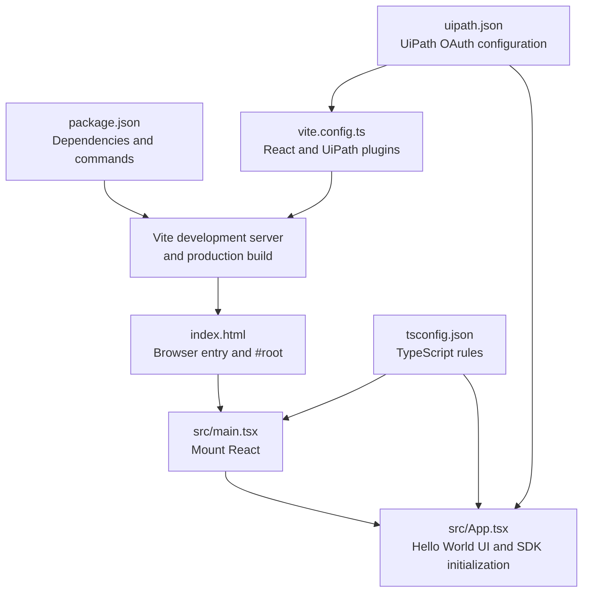

# Hello World: React + TypeScript + Vite + UiPath SDK

This is a deliberately small teaching project for an audience that is new to JavaScript and React. It displays **Hello World!!**, compiles with Vite, and installs and initializes the UiPath TypeScript SDK. It does not call a UiPath service.

## Learning outcomes

By the end, learners should understand:

1. Which authored files make a small React application work.
2. How the browser, Vite, TypeScript, and React connect.
3. Where npm dependencies and commands are declared.
4. How UiPath configuration reaches the SDK.
5. Which folders are generated rather than authored.

## Visual file map



The main runtime path is:

`index.html` → `src/main.tsx` → `src/App.tsx`

## Files included

| File | Why it exists | Required for |
| --- | --- | --- |
| `package.json` | Lists packages and the `dev`, `build`, and `preview` commands. | Installation and build |
| `index.html` | Gives the browser a page and provides `<div id="root">`. | Vite and browser |
| `src/main.tsx` | Finds `root` and asks React to render the application. | React startup |
| `src/App.tsx` | Defines the visible UI and initializes the UiPath SDK. | Application behavior |
| `tsconfig.json` | Defines how TypeScript checks `.ts` and `.tsx` files. | Type checking |
| `vite.config.ts` | Enables the React plugin, UiPath local-development plugin, and relative production paths. | Vite + UiPath integration |
| `uipath.json` | Holds non-confidential OAuth and tenant configuration used by the UiPath plugin. | UiPath SDK initialization |
| `.gitignore` | Prevents generated folders from entering source control. | Project hygiene |
| `README.md` | Contains the lesson and setup instructions. | Teaching only |

`package-lock.json`, `node_modules/`, and `dist/` are generated. Learners should not create them manually.

## Prerequisites

- Node.js 20.19+ or 22.12+ for the current Vite release.
- npm 8 or later.
- A modern browser.
- For real UiPath initialization: access to a UiPath Automation Cloud organization and permission to register or use a non-confidential External Application.

Check the installed tools:

```bash
node --version
npm --version
```

## Step-by-step setup

### 1. Open the project

Extract the ZIP and open a terminal in the extracted directory:

```bash
cd uipath-react-vite-hello-world
```

### 2. Understand `package.json`

The important sections are:

- `dependencies`: packages needed by the application in the browser—React and the UiPath TypeScript SDK.
- `devDependencies`: tools used while developing or compiling—Vite, TypeScript, the React plugin, and UiPath's Vite plugin.
- `scripts`: memorable npm commands that run the tools.
- `type: module`: allows modern `import` and `export` syntax in project configuration.

### 3. Install packages

```bash
npm install
```

This reads `package.json`, downloads the packages into the generated `node_modules/` folder, and creates or updates `package-lock.json`.

### 4. Configure the UiPath External Application

For a browser application, use OAuth with a **non-confidential** External Application. Do not place a client secret or personal access token in browser code.

In UiPath Automation Cloud:

1. Open **Admin → External Applications**.
2. Add a **Non-confidential Application**.
3. Set its redirect URI to `http://localhost:5173` for this lesson.
4. Select only the UiPath scopes that a future use case will need.
5. Save the application and copy its client ID.

Replace the placeholder values in `uipath.json`:

```json
{
  "clientId": "your-client-id",
  "scope": "your selected scopes",
  "orgName": "your-organization-name",
  "tenantName": "your-tenant-name",
  "baseUrl": "https://api.uipath.com",
  "redirectUri": "http://localhost:5173"
}
```

The UiPath Vite plugin reads this file during local development and makes the configuration available to the SDK. When the application is deployed as a UiPath Coded App, the platform supplies the configuration.

### 5. Start the development server

```bash
npm run dev
```

Open the URL printed by Vite, normally `http://localhost:5173`.

Vite watches the source files. When a learner changes `Hello World!!` in `src/App.tsx` and saves, the browser updates without a full manual restart.

### 6. Initialize the UiPath SDK

Click **Initialize UiPath SDK**.

The important code is:

```ts
import { UiPath } from '@uipath/uipath-typescript/core'

const sdk = new UiPath()
await sdk.initialize()
```

`new UiPath()` creates the SDK object. `initialize()` starts or completes the OAuth flow. It may redirect the browser to UiPath sign-in. No UiPath process, queue, asset, or other service is called in this boilerplate.

If the placeholders in `uipath.json` have not been replaced, initialization is expected to fail. The Hello World part of the app still runs.

### 7. Create a production build

```bash
npm run build
```

This performs two jobs:

1. `tsc --noEmit` checks the TypeScript without generating JavaScript files.
2. `vite build` compiles and bundles the application into the generated `dist/` folder.

Test that production output locally:

```bash
npm run preview
```

## Teaching walkthrough

### `index.html`: browser entry

```html
<div id="root"></div>
<script type="module" src="/src/main.tsx"></script>
```

- The browser loads HTML first.
- `root` is an empty container that React will control.
- The module script hands control to `main.tsx`.

### `src/main.tsx`: React entry

```tsx
createRoot(document.getElementById('root')!).render(
  <StrictMode>
    <App />
  </StrictMode>,
)
```

- `document.getElementById('root')` finds the HTML container.
- `createRoot(...)` gives that container to React.
- `<App />` means “render the App component here.”
- `<StrictMode>` helps expose common development mistakes; it does not add visible UI.

### `src/App.tsx`: component and interaction

- `function App()` defines a React component.
- JSX is the HTML-like syntax returned by the component.
- `useState(...)` stores text that can change while the app is running.
- `onClick={initializeUiPathSdk}` connects the button to a TypeScript function.
- `try/catch` changes the status for either success or failure.

### `vite.config.ts`: build integration

```ts
export default defineConfig({
  base: './',
  plugins: [react(), uipathCodedApps()],
})
```

- `react()` enables React development features.
- `uipathCodedApps()` reads `uipath.json` during local development.
- `base: './'` produces relative asset paths suitable for deployment under a UiPath Coded App path.

## Mandatory versus generated

| Authored and kept in source control | Generated by commands |
| --- | --- |
| `package.json` | `node_modules/` after `npm install` |
| `index.html` | `package-lock.json` after `npm install` |
| `tsconfig.json` | `dist/` after `npm run build` |
| `vite.config.ts` | |
| `uipath.json` | |
| `src/main.tsx` | |
| `src/App.tsx` | |

## Suggested five-minute live exercise

1. Run the app and confirm **Hello World!!** appears.
2. Change the heading to the audience's name and save.
3. Point out the instant browser update from Vite.
4. Show how the button changes React state.
5. Open `vite.config.ts` and `uipath.json` to explain how the UiPath SDK gets its configuration.
6. Run `npm run build` and show that `dist/` is generated output, not source code.

## Common beginner issues

| Symptom | Likely cause | Fix |
| --- | --- | --- |
| `npm` is not recognized | Node.js is not installed or the terminal was opened before installation. | Install a supported Node.js version and reopen the terminal. |
| Port 5173 is already in use | Another local server is running. | Stop it, or update both the Vite port and registered redirect URI together. |
| Blank page | The `root` ID or script path in `index.html` was changed. | Restore `id="root"` and `/src/main.tsx`. |
| UiPath initialization fails | `uipath.json`, client ID, redirect URI, or selected scopes do not match the External Application. | Compare every value with the UiPath configuration. |
| Build fails but development worked | TypeScript found a type error. | Read the first error from `npm run build` and fix the referenced source line. |

## Deliberately excluded

To keep the lesson focused, the boilerplate does not include routing, CSS frameworks, API calls, tests, state libraries, or a backend. Add those only after the audience understands this file flow.

## Official references

- [UiPath TypeScript SDK—Getting Started](https://uipath.github.io/uipath-typescript/getting-started/)
- [UiPath TypeScript SDK—Authentication](https://uipath.github.io/uipath-typescript/authentication/)
- [UiPath Coded Apps—Getting Started](https://uipath.github.io/uipath-typescript/coded-apps/getting-started/)
- [Vite—Getting Started](https://vite.dev/guide/)
- [React—Build a React app from scratch](https://react.dev/learn/build-a-react-app-from-scratch)
